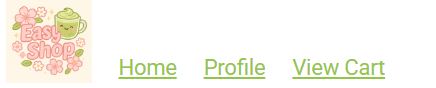
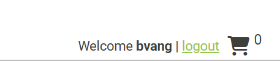
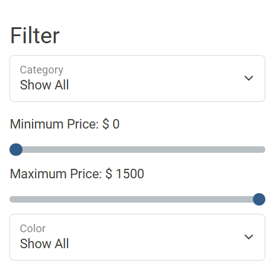

# Capstone 3: EasyShop E-Commerce API & Web Application 🛍️

<p align="center">
  
</p>

Welcome to EasyShop, a full-stack e-commerce application project designed for users to browse, search, and purchase products online. This application simulates a real-world online shopping experience and includes both backend API development (using Spring Boot and MySQL) and a frontend user interface (HTML/CSS). ⋆ ˚｡⋆୨🍓୧⋆ ˚｡⋆


## 🌐 Project Overview

✔️ Features Implemented:

- 🔍 Product browsing and searching
- 🗂️ Viewing product details
- 📁 Browsing products by category

This project was built to demonstrate CRUD operations, API consumption using Postman, database integration, and frontend rendering with HTML templates.

⚠️ Note: Some features such as the shopping cart and checkout are under development and not fully functional. The ShoppingCart and ShoppingCartItem models are in place, but viewing and adding to cart currently fails due to unresolved backend issues.


## 🧭 Future Features

| Priority | Feature |
|----------|---------|
| 🔒 High  | Fix shopping cart functionality             |
| 🔐 High  | Add user authentication (login/register)    |
| 💳 Medium| Integrate checkout and payment simulation   |
| 💾 Medium| Implement order history and receipts        |
| 💬 Medium| Enable product reviews and star ratings     |
| 🎁 Medium| Add wishlist/favorites                      |
| 🔄 Low   | Add sorting to product listings             |
| 📱 Low   | Mobile-friendly/responsive design           |

## 🔧 Technical Notes & To-Do
- Debug the cart loading issue (likely related to the cart DAO or database table structure)
- Complete addToCart() and viewCart() endpoints
- Ensure foreign key constraints are properly set up for cart and cart items
- Add exception handling for better error responses
- Validate product quantity before cart updates

## 🛠️ Tech Stack
- Backend: Java, Spring Boot, MySQL
- Frontend: HTML, CSS
- Tools: IntelliJ, Git, GitHub, Postman (for API testing)

## Screenshots
Here’s a look at the current state of the EasyShop application:

Note: This is a single-page application. Features like the cart and checkout are still under development.

#### Logo


#### 🧭 Header & Navigation


---

#### 👤 User Info & Logout


---

#### 🔍 Filtering


---

#### 🛒 Product Listing


### Fun Fact Endpoint

You can get a random fun fact about the products by calling:

GET /products/funfact

**Response example:**

```json
{
  "funFact": "Did you know? Electronics is the fastest-growing category!"
}

Each time you call this endpoint, you will receive a different random fun fact from a small curated list, perfect for adding some personality or fun messages to your application or testing!

This endpoint is implemented in ProductsController like this:

```java
@GetMapping("/funfact")  // Handles GET requests to /products/funfact
public Map<String, String> randomFunFact() {
    String[] funFacts = {
        "Did you know? Electronics is the fastest-growing category!",
        "Fun fact: Our 'Books' category has over 10,000 titles!",
        "Our 'Clothing' category features items from over 100 brands!",
        "We update categories weekly to keep things fresh!"
    };
    int index = (int) (Math.random() * funFacts.length);
    return Map.of("funFact", funFacts[index]);
}
```
